<!--
  Hi there! 👋
  Welcome to my GitHub profile.
  This README uses GitHub's Markdown & shields for a clean, minimal, and slightly futuristic vibe.
  For best effect, view this on GitHub's dark mode!
-->

<h1 align="center" style="border-bottom: none;">
  
</h1>

  

---

### 👨‍💻 About Me

I am a passionate **Fullstack Developer** with a flair for futuristic UI, DX, and robust backend solutions.  
I specialize in delivering seamless, responsive, and performant web & mobile applications.

- 🚀 Building with **Flutter/Dart**, **React**, **Next.js**, **TypeScript**, **MERN**, **Vue.js**, **Swift**, **Tailwind CSS**, **Python**.
- 🎨 Minimalist by design, futurist at heart.
- 🌏 Open-source & collaboration enthusiast.
- 🛠️ Always learning, always building.

---

### 🛠️ Tech Stack

```mermaid
flowchart LR
  A[Flutter/Dart] -- Mobile --> B((📱))
  C[React/Next.js] -- Web --> D((🖥️))
  E[MERN Stack] -- Fullstack --> F((🌐))
  G[TypeScript] -- Typed JS --> D
  H[Python] -- Backend/API --> F
  I[Swift] -- iOS --> B
  J[Vue.js] -- UI Framework --> D
  K[Tailwind CSS] -- Styling --> D
```

---

### 📊 Stats & Activity

  
  

---

### 📫 Connect

---

  

<!--
  Responsive, minimal, and "reactive" via SVGs & shields.
  For a more dynamic profile, link to GitHub Actions or personal portfolio.
-->
